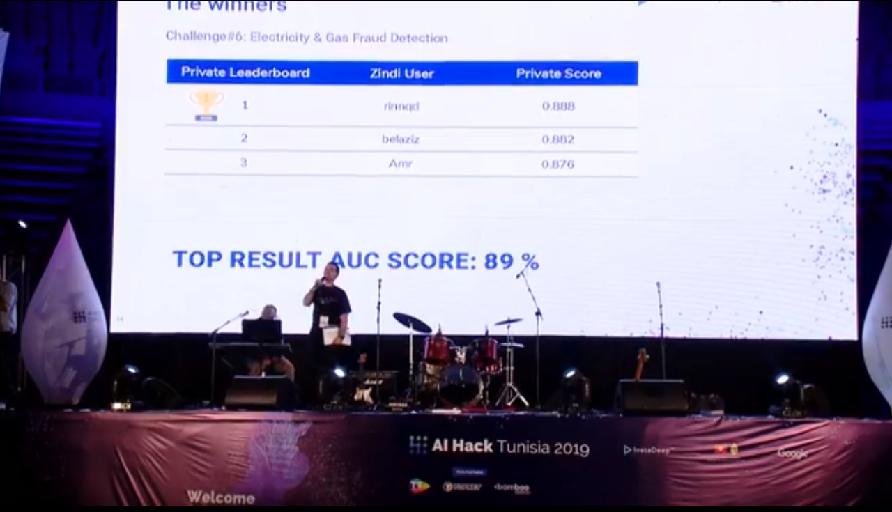

# Fraud Detection in Electricity and Gas Consumption Challenge - Winner Solution - AI Hack Tunisia 2019



### About the Event

AI Hack Tunisia 2019 is the largest Hackathon on Artificial Intelligence and Machine Learning in the MEA Region. Organized by InstaDeep, Google, and the Ministry of Industry, Mines and Energy, the event brings together students, developers, tech entrepreneurs, researchers, Ph.D. holders, and startups to create innovative solutions using Artificial Intelligence.

### Competition Overview

#### Event Format

1. Individual Competitions:
   - Multiple competitions in Artificial Intelligence simultaneously.
   - Participants choose a problem to work on within a 20-hour timeframe.
   - Problems span various AI areas and use different AI tools (computer vision, NLP, Reinforcement Learning, etc.).

2. Startup (or Group) Competition:
   - Small teams (2-4 people) work for an additional 26 hours to create a startup idea in AI.
   - Focus on developing a mobile application as the first steps towards the creation of a startup.
   - Teams pitch their ideas to an expert jury, and a winner is selected.

#### Competition Theme

The challenge addressed by the winning solution was proposed by the Tunisian Company of Electricity and Gas (STEG). As a public and non-administrative company, STEG is responsible for delivering electricity and gas across Tunisia. The company faced significant financial losses, approximately 200 million Tunisian Dinars, due to fraudulent manipulations of meters by consumers.

### Competition Description

#### Problem Statement

Utilizing the client’s billing history, the challenge aimed to detect and recognize clients involved in fraudulent activities. The primary goal was to develop a solution that could enhance the company’s revenues and reduce losses caused by fraudulent activities.

### Repository Files
- `feature_preparation.py`: Prepares features using the existing dataset.
- `model.py`: Defines model parameters.
- `split_data.py`: Implements validation strategy and cross-validation.
- `test.py`: Performs inference on the test set of the competition.
- `train.py`: Handles model training.

### How to Use

1. Clone the repository:
```
git clone https://github.com/your-username/fraud-detection-ai-hack-tunisia.git
```
2. Navigate to the repository:
```
cd fraud-detection-ai-hack-tunisia
```
3. Run the necessary scripts according to your needs:
```
python feature_preparation.py
python train.py
python test.py
```

### Acknowledgments

This repository contains the winning solution developed during AI Hack Tunisia 2019. We extend our gratitude to the event organizers, sponsors, and the Tunisian Company of Electricity and Gas for providing this real-world challenge.

### Contact

For inquiries or further information, please contact the repository owner:

- Maintainer: Firas Baba (firas.baba96@gmail.com)

### Apply and Get Involved

If you are interested in participating in future events or supporting AI Hack Tunisia, visit AI Hack Tunisia website/social media for more information.
- Website: https://ai-hack-tunisia.com/
- Facbeook page: https://www.facebook.com/AIHackTunisia/
- Twitter page: https://twitter.com/AIHackTunisia


